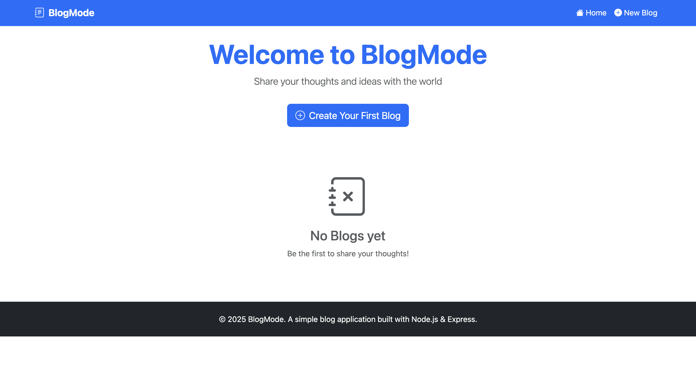
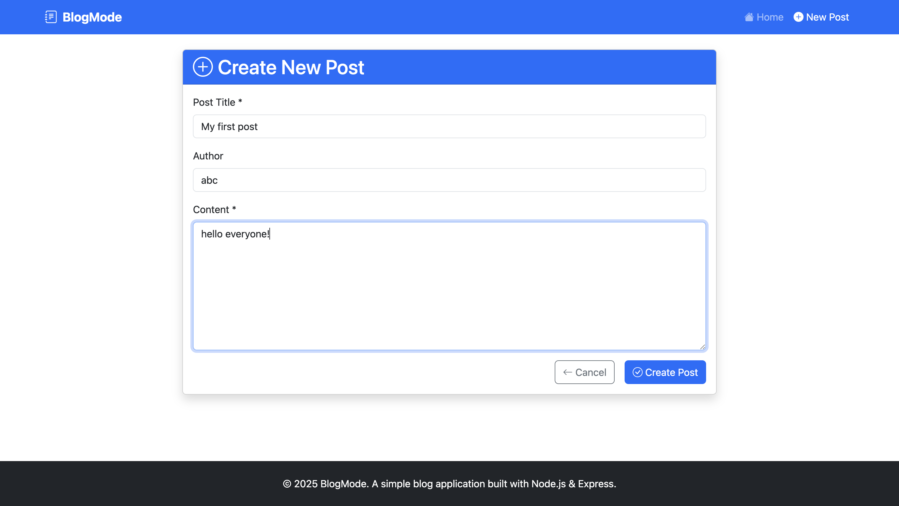
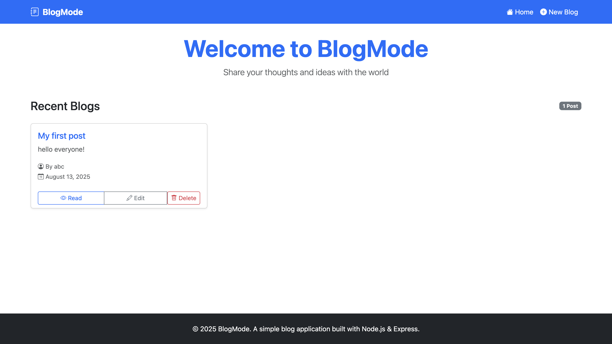
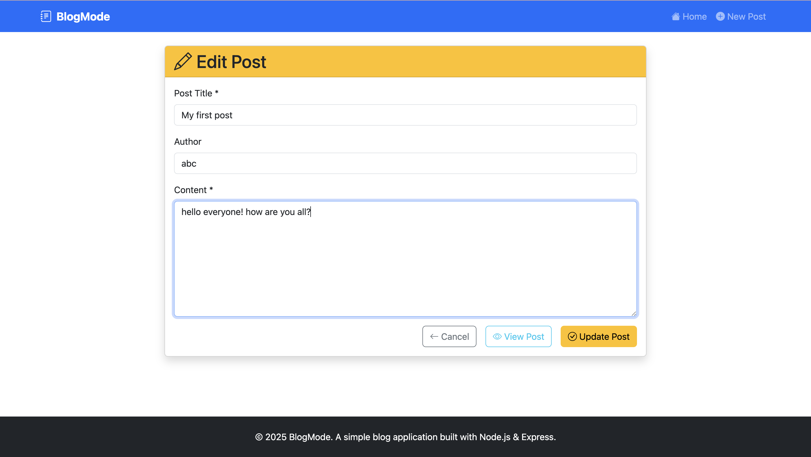
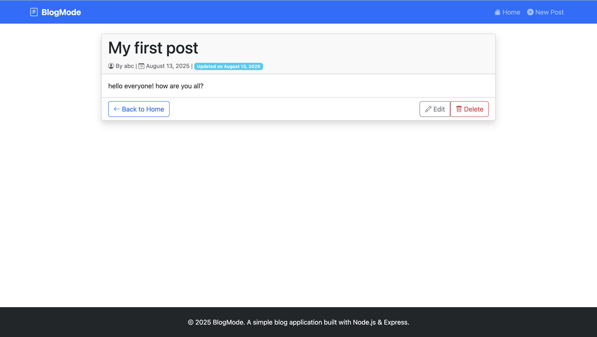

# BlogMode 📝

A simple and elegant blog application built with Node.js, Express.js, and EJS. Create, read, update, and delete blog posts with a beautiful responsive interface powered by Bootstrap.

## ✨ Features

- Create Posts: Write new blog posts with title, content, and author
- View Posts: Browse all posts on a clean, card-based home page
- Read Posts: View full post content on dedicated post pages
- Edit Posts: Update existing posts with ease
- Delete Posts: Remove posts with confirmation
- Responsive Design: Works perfectly on desktop and mobile devices
- Modern UI: Clean interface with Bootstrap.

### 🚀 Prerequisites

To run this project locally, you'll need Node.js, express.js and npm (Node Package Manager) installed. Follow the steps below to set up the project on your local machine:

### Installation

1. Clone the repository
   
   git clone https://github.com/yourusername/blogmode.git
   
   cd blogmode
   

2. Install dependencies

   npm install
   

3. Start the application

   nodemon index.js
   

4. Open your browser
   
   http://localhost:3000
   

## 🛠️ Technology Stack

- Backend: Node.js, Express.js
- Frontend: EJS, Bootstrap 5, Custom CSS
- Icons: Bootstrap Icons

## 📝 Usage

1. Home Page: View all your blog posts in a beautiful card layout
2. Create Post: Click "New Post" to write a new blog entry
3. View Post: Click "Read" on any post to see the full content
4. Edit Post: Click "Edit" to modify existing posts
5. Delete Post: Click "Delete" to remove posts (with confirmation)

##  Important Note!!

- Data Persistence: Posts are stored in memory and will be lost when the server restarts as no databases is used for now here.

## 🎨 Screenshots

This is the Home Page.

This is the page that opens when you want to create a post.

This is the home page showing the post you have created.

This is edit page.

This is the view page that lets you view your post.

## 🤝 Contributing

Contributions are welcome! If you have suggestions for improvements or new features, please create an issue or submit a pull request.

## 🙏 Acknowledgments

- Bootstrap team for the amazing CSS framework
- Express.js community for the excellent documentation
- EJS for the simple and powerful templating engine

Happy Blogging! 🎉